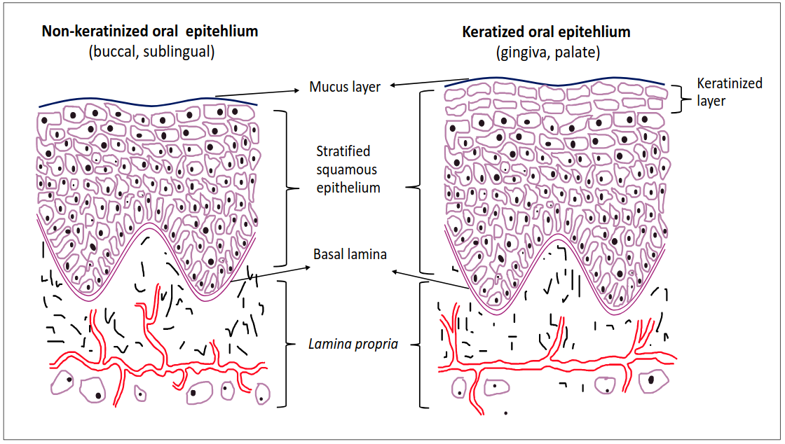
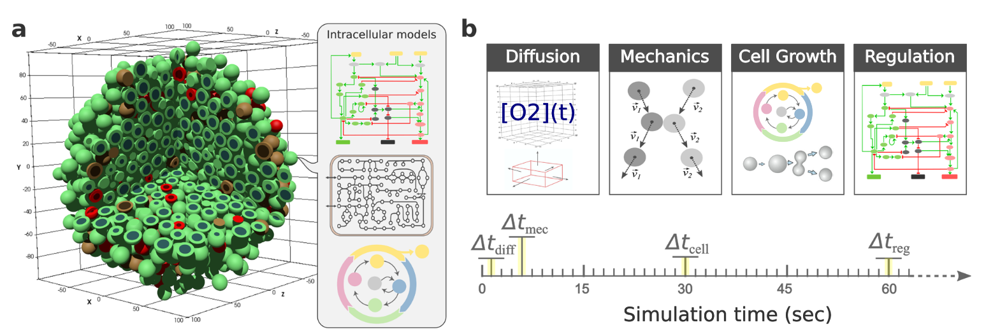
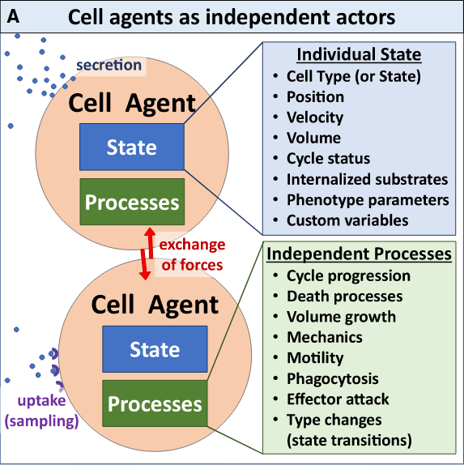
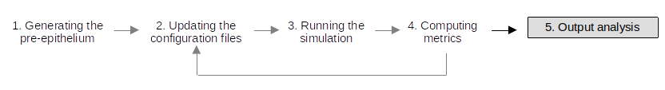
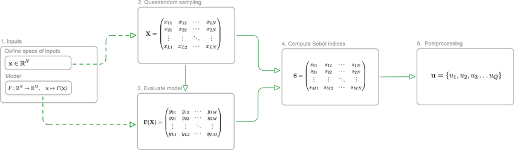

# Modelling the Oral Epithlium in PhysiCell

## Table of contents
- [Introduction](#introduction)
- [Presentation of the Oral Epithelium](#presentation-of-the-oral-epithelium)
  - [Structure and composition](#structure-and-composition)
  - [Properties](#properties)
- [Key Mechanisms in Epithelium Homeostasis](#key-mechanisms-in-epithelium-homeostasis)
  - [Division model](#division-model)
  - [Treadmill Movement](#treadmill-movement)
  - [Differentiation](#differentiation)
  - [Death Regulation](#death-regulation)
- [PhysiCell Overview](#physicell-overview)
  - [A Quick Guide to the PhysiUniverse](#a-quick-guide-to-the-physiuniverse)
  - [Agents and the interactions](#agents-and-the-interactions)
    - [What is a PhysiCell agent?](#what-is-a-physicell-agent)
    - [How do agents interact with other agents?](#how-do-agents-interact-with-other-agents)
    - [How do agents evolve in time?](#how-do-agents-evolve-in-time)
  - [PhysiCell in practice](#physicell-in-practice)
- [Running Epithelium Simulations](#running-epithelium-simulations)
  - [Analysis Pipeline](#analysis-pipeline)
    - [Initialization](#initialization)
    - [Parameters Update](#parameters-update)
    - [Running](#running)
    - [Post Processing](#post-processing)
- [Sensibility Analysis](#sensibility-analysis)
  - [The SALib package](#the-salib-package)
  - [Sobol Analysis: input/output](#sobol-analysis-inputoutput)
    - [In practice the scripts](#in-practice-the-scripts)
    - [Experiments](#experiments)
    - [Results](#results)
- [Parametrization](#parametrization)
  - [Gradient Descent](#gradient-descent)
    - [PhysiCOOL Package](#physicool-package)
    - [Workflow and output](#workflow-and-output)
    - [Modifications to PhysiCell](#modifications-to-physicell)
  - [Bayesian Optimization](#bayesian-optimization)
- [Perspectives](#perspectives)
  - [Implementing Lineage Tracing](#implementing-lineage-tracing)
  - [Implementing Dilution Experiments](#implementing-dilution-experiments)

---

## Introduction
Head and Neck Squamous cell carcinoma (HNSCC) was the 7th most prevalent cancer in 2020, it leads to approximately 450,000 deaths per year. The oral cavity is the most frequently impacted anatomical region. This carcinoma are known as Oral Squamous Cell Carcinoma (OSCC). It is the deadliest among HNSCC. Moreover, it leads to severe disfugurements and functional impairments. Understanding the multiple factors at play in OSCC oncogenesis therefore appears essentail. This would enable better prognostic predictions as well as early detection, which is key in improving patients outcome and quality of life. [these yannick]
A lot remains unknown about OSCC carcinogenesis. **We aim to decipher the conditions of OSCC establishment and maintenance.**

We assume that mechanical effects as well as chemical signal (through contact and diffusion) from differentiated cells are necessary to ensure the treadmill behavior of the epithelium observed in vivo. To this end, we built a Agent Based Modelling (ABM) framework of an healthy epithelium, using PhysiCell<a href="#ref16">16</a>, to integrate spatial considerations. PhysiCell is a physics-based multicellular simulator. We first attempt to identify minimal conditions for homestasis emergence in a PhysiCell simulation. We will try to determine if we can build a model encompassing the key biological propeties epithelium. Through sensibility analysis, we will then establish which parameters influence epithelium stability. Finally, we will try to asses the existence of a parameter space enabling epithelium stability and coherent with dynamics of oral epithelium in vivo and in vitro. 

The following [poster](figures/poster.png) summarizes the project.

## Presentation of the Oral Epithelium

The oral epithelium is complex stratified tissue formed of multiple layers of different type of cells. Despite, renewing very fast (~15 days for total renewal) its topology is highly conserved in time. This robustness is essential as this epithelium is the first barrier to physical and chemical insults from mastication, food, and microorganisms. It remains unclear how homeostasis is established and maintain in time. Pathways for epithelial stem cell division regulation are still under investigation. Understanding epithelium maintenance and renewal is essential to understand the mechanisms of cancer maintenance.
 *Shematic representation of oral mucose structure from Int. J. Mol. Sci. 2021, 22, 7821. [https://doi.org/10.3390/ijms22157821](https://doi.org/10.3390/ijms22157821)*

### Structure and composition
In keratinized oral mucosa, the epithelium stratifies into four layers (stratum basale, stratum spinosum, stratum granulosum, and stratum corneum), while on the other hand, it consists of three layers (stratum basale, stratum filamentosum, and stratum distendum) in non-keratinized tissue. (Mu, 2024). In this model, we will focus on non-keratinized epithelhium. Moreover, we will focus on a simplified model of this epithelium. We will consider 2 layers in the epithelium (2 cells type) rather than 3, dividing epithelium basal cell and differentiated epithelium cells. It is also important to not that we will not take into account morphological deformations of cells that elongates as they differentiate. Indeed, PhysiCell only allows for spherical cell agents. This difference in morphology will certainly affect the dynamics of homeostasis, however we assume this difference should not prevent the emergence of homeostasis and robustness under similar cues. 

### Properties
(Describe physical, mechanical and biochemical properties here.)

## Key Mechanisms in Epithelium Homeostasis

### Division model
To maintain a constant number of proliferating cells, on average each cell division must generate one daughter that will go on to divide and one that will differentiate after first exiting the cell cycle. However, the nature  of the dividing cell population was subjected to controversy:

Lineage tracing has ruled out older deterministic models of a proliferative hierarchy of asymmetrically dividing stem cells generating ‘transit amplifying’ cells that undergo a fixed number of divisions prior to differentiation.

Tracking of labeled cells in transgenic mice revealed that the most likely division model was the **single progenitor division hypothesis**: 

All dividing keratinocytes are functionally equivalent and generate dividing and differentiating daughters with equal probability

Additionally, **the orientation of these divisions are not random, they occur predominantly in the basal layer**. Cells that exits the basal layer eventually differentiate. This stratification occurs trough a mechanical process, cells are squizzed out from the basal layer due to other division occuring in the basal layer. **Therefore, here we assume that stratification is the main driver of differentiation,** even though basal layer cell can differentiate at a fixed rate**.**

### Treadmill Movement
The effect of crowding, hence the need for an ABM which models mechanical interactions.

### Differentiation
Uncertain mechanisms; the important gradient; phenotypic modifications of cells as they migrate upward; the role of cell-cell and cell-matrix adhesion in stemness and differentiation.

### Death Regulation
We assume that cell death occurs predominantly through **anoikis, and apoptosis**:

Anoikis = upon cell detachment of the ECM, in our model the other cells and the tissue it self, cell can die

Additionally, epithelium cell can undergo apoptosis. 

Moreover, the number of cell in the epithelium is regulated through differentiation signal, differentiated cells favor stem cell differentiation, therefore in absence of a sufficient number of differentiated cells, division of basal cell will be favored.

## PhysiCell Overview

PhysiCell is an open source physics-based cell simulator for 3-D multicellular systems. Interactions between agents are modeled as set of potential functions of simplified mechanical interactions.[PhysiCell citation].

### A Quick Guide to the PhysiUniverse
This is only a brief introduction to the PhysiCell framework. For details and tutorials please refer to the official documentation and tutorials:

- Installing PhysiCell:
  - [Linux](https://github.com/physicell-training/ws2023/blob/main/setup/physicell_setup_poweruser_linux_v20250227a.pdf) 
  - [Windows](https://github.com/physicell-training/ws2023/blob/main/setup/PhysiCell_ws2023_Windows_setup.pdf)
  - [MacOS](https://github.com/physicell-training/ws2023/blob/main/setup/PhysiCell_ws2023_macOS_setup.pdf)

- Tutorial:
  - [2023 Workshop](https://github.com/physicell-training/ws2023/tree/main/sessions)
- PhysiCell Addons and tools:
  - [PhysiMeSS](https://github.com/PhysiMeSS/PhysiMeSS) : Modelling the ExtraCellular Matrix (ECM) as agents
  - [PhysiCool](https://physicool.readthedocs.io/en/latest/) : Module to perform gradient descent
  - [PhysiS&S](https://github.com/smilies-polito/PhysiSandS) : Module to start and resume a simulation from a saved state
  - [UQPhysiCell](https://uq-physicell.readthedocs.io/en/latest/) : Sensitivity analysis and Bayesian optimization 
  - [PhysiCell Studio](https://github.com/PhysiCell-Tools/PhysiCell-Studio) : GUI for PhysiCell
  - [PhysiPKPD](https://github.com/drbergman/PhysiPKPD): A pharmacokinetics and pharmacodynamics module for PhysiCell
  - [BIWT](https://github.com/drbergman/BIWT-Paper): a bioinformatics walkthrough for embedding spatial multiomics in agent-based models for virtual cells

- [Non-exhaustive Bibliography of tools and addons of PhysiCell but also papers using the PhysiCell framework](figures/physicell_bibli.bib)

### Framework

PhysiCell is designed to for building multicellular simulations that investigate the relationship between (diffusional) substrate limitations, multicellular biochemical communication, and essential phenotypic processes.  
It uses a latticefree, physics-based approach. It provides optimized, biologically realistic functions for key cell behaviors, including: cell cycling (multiple models for in vitro and in vivo-focused simulations), cell death (apoptosis and necrosis), volume regulation (fluid and solid biomass; nuclear and cytoplasmic sub-volumes), motility, and cell-cell mechanical interactions. It is fully coupled to a fast multi substrate diffusion code (BioFVM) [cite BioFVM] that solves for vectors of diffusing substrates, so that users can tie cell phenotype to many diffusing signals.  
Diffusive biotransport occurs at relatively fast time scales (on the order of 0.1 min or faster) compared to cell mechanics (* 1 min) and cell processes (* 10 to 100 min or slower). PhysiCell takes advantage of this by using three separate time step sizes (Δtdiff, Δtmech, and Δtcells). In particular, the cell phenotypes and arrangement (operating on slow time scales) can be treated as quasi-static when advancing the solution to the biotransport PDEs, so BioFVM can be called without modification with the cell arrangements fixed. PhysiCell provides default time step sizes that should suffice for typical applications in cancer biology and tissue engineering. 

 *Figure from [PhysiBoSS 2.0 paper citation] shows a schematic representation of an agent-based model of a 3D multicellular system in a microenvironment defined by the domain divided into fixed volumes together with examples of different intracellular models including signalling network, metabolism and cell cycle. b. depicts examples of the different simulators and time scales for a multi-scale model including, the Δtdiff time scale where diffusion, uptake and secretion processes are updated; Δtmec where the mechanics (movement and physical interactions) are updated; Δtcell in which cell processes such as volume, cell cycle and death models are updated; and Δtreg the regulatory time scale in which Boolean models are updated.*

### Agents and Interactions

#### More details about PhysiCell agents
Definition of an agent in PhysiCell: state, phenotype, internal variables, and behaviors.

  

*Schematic representation of a Cell agent in PhysiCell (figure from [Cell rule paper citation])* 

#### Agents mechanics

As defined in PhysiCell and a previous model presenting agent-based cell mechanics , we consider that the unknown cell morphology can be approximated by a spherical cell of equivalent volume. Cells are able to adhere or be repelled by other agents in a radius Ra. Each cell is attributed the position of its center, a velocity and a radius, that can evolve in time. To account for cell deformation, they are able to partially overlap with other agents. The user can set the deformability ability for each cell type. Cells can move at a user defined speed, and the direction of migration depends on chemotactics signals and stochastic brownian movement. Cells’ velocity is modified upon interactions. We consider inertia negligible, as it has been observed experimentally for cells. Hence, we make the assumption:
$m_i v̇_i ≈ 0 (1)$

Thus, once an agent is no longer subjected to forces, its motion ceases in the order of a timestep.

#### How do agents move in time?
At each timestep, we determine the position of an agent by computing its velocity. To solve for each agent's velocity, we use Newton's second law of motion:

The inertialess assumption gives us: $m_i * dv_i/dt ≈ 0$

Newton's second law for agent motion becomes:

$m_i * dv_i/dt = Σ(F_{cca}^{ij} + F_{ccr}^{ij}) + F_{loc}^i + F_{drag}^i$

where the first sum represents cell-cell interactions (adhesion and repulsion forces) and the second sum represents cell-fibre interactions.

We take *i* a cell among the *N(t)* agents at time *t*, with a velocity **$v_i$** and a mass $*m_i*$.  $F_{cca}^{ij}$ and **$F_{ccr}^{ij}$** are respectively the force of adhesion and repulsion on *i* exerted by a cell agent *j* in proximity of *i*. For details about cell-cell interactions, we refer you to Macklin & al. DCIS model in which they were defined. **$F_{loc}^i$** corresponds to the motility force of cell's *i*. **$F_{drag}^i$** represents the drag of the microenvironment, that we can describe as **$F_{drag}^i = -ν_iv_i. ν_i$** was not explicitly described in PhysiCell. The user is rather expected to adjust the different cell's mechanic parameter to account for it.

Given the equations above and the inertialess assumption, we obtain:

$v_i = (1/ν_i) * [Σ(F_{cca}^{ij} + F_{ccr}^{ij}) + F_{loc}^i]$

The agent's position is then updated using the second-order Adam's Bashforth discretization.

#### How do the cells' phenotype evolve in time?
Phenotype updates, cell cycle progression, death, and movement.

### PhysiCell in practice

I made modifications to the PhysiCell 1.14.2 (see [changes.md](changes.md)) to integrate the PhysiS&S module, prevent crashes at runtime, constrain cell types in the simulated space, and modified XML parsing to facilitate user interaction. I also created a number of custom functions to initialize simulations and to choose the orientation of division. However, **any project working for the published version of PhysiCell 1.14.2 should compile and run in this version as well** and produce the same results.

You can look at this presentation, from a 2023 PhysiCell workshop, to understand the structure of the PhysiCell repository, it is up to date with the 1.14.2 version (no major changes): [Working with
PhysiCell Projects](https://github.com/physicell-training/ws2023/blob/main/sessions/session_01/PhysiCell_ws2023_Session01.pdf)

Moreover, you can look at this file: [Running epithelium simulations](tutorial/epithelium_simulation.md)

## Running Epithelium Simulations

### The different user projects

### Analysing simulations

## Sensitivity Analysis
For one simulation in PhysiCell, more than one hundred parameters needs to be set. The number of parameters directly depends from the complexity of the model, specifically the number of cell types. Here we will focus on only 4 cell types, which corresponds to about 120 parameters. For each parameter, we use at start default PhysiCell values, those are set from litterature or from experiments with PhysiCell. We therefore need to drastically reduce model dimensionality to be able to explore parameter space and establish conditions of healthy epithelium stability. To do so, we will perform Global Sensitivity Analysis (GSA). We establish a pipeline following the above scheme for sensitivity analysis. Sensitivity analysis is “the study of how the uncertainty in the output of a mathematical model or system (numerical or otherwise) can be apportioned to
different sources of uncertainty in its inputs.”  The sensitivity of each input is often represented by a numeric value, called the ***sensitivity index***.

We will use the SaLib python package to perform the sensibility analysis.[SaLib citation] This package supports several methods for sensitivity analysis. We will use the Sobol method, a variance based approach [Sobol citation, Saltelli and Annoni 2010 citation]. It is a common method, enablling to explore nth order interactions.This method relies on the variance decomposition of the model output and attribution to a parameter or a set of parameter of the model. The relative influence of the different parameters on the output is summarized by a set of indices. As a output of the Sobol method in SaLib we obtain per parameter or group of parameter: 

1. **First-order indices (S1):** measure the contribution to the output variance of a single
model input.
2. **Second-order indices (S2):** measure the contribution to the output variance caused by
the interaction of two model inputs.
3. **Total-order index (ST):** measure the contribution to the output variance caused by
a model input, including both its first-order effects and all higher-order interactions.

Along with each indices, ST, S1, and S2 we have a corresponding confidence intervals, by default with a confidence level of 95%.

#### Brief overview of Sobol indices computation:
 (Schematic representation from [Weerasinghe] ).
The method implemented in SaLib is not the original Sobol algorithm published in 1990 [Sobol Citation] but rather an improved more recent version of the algorithm (Saltelli 2010)
1. We define a space of inputs, parameters or group of parameters and their bounds. We consider the model as a black box, written above as the function F, therefore GSA works with any form model from ODE to ABM.
2. Then a quasi-random sampling method is used to obtain a independent uniformly distributely set of inputs within the hypercube. This enables to write the model output as:
$$ Y=F_{0}+\sum _{i=1}^{d}F_{i}(x_{i})+\sum _{i;j}^{d}F_{ij}(x_{i},x_{j})+\cdots +F_{1,2,\dots ,d}(x_{1},x_{2},\dots ,x_{N}) $$
From this equation we can derive the variance of the output:
$$ V(Y) = \sum V_i + \sum _i\sum_{i<j}V_{ij} + \dots + V_{1,2,\dots,N} $$ and also compute the partial variance which for the first order is written as: $$ V_i = V_{x_i}[E_{x_{\sim i}}(x_i)]$$ where $x_{\sim i}$ indicates all the variables except $x_i$. 
This gives as sobol index of the 1st order: $$S_{i}={\frac {V_{i}}{{Var} (Y)}}$$ Sobol indices of higher order are of the same form partial variance over global variance. The form of these indices displays the importance of evaluating independent parameters or groups of parameters.  

### Experiments
We are going to run a number of sensitivity analysis, one per property of the epithelium we aim to recreate:
  - Permeability: Cells (like immune cells) should be able to move through the different layers of the epithelium without compromising the overall stratification.
  - Structure: As it grows ( is submitted to other kind of mechanical stimuli), the epithelium should preserve its four distinct layers
  - Localized division: Division should not occur anywhere in the tissue, they should occur predominantly in the basal layer
  -Localized death: Death should occur predominantly at the highest position of the epithlium in a shedding process.
  - Size stability: Balancing of division and death should result in an epithelium of a stable thickness.

To evaluate this different properties, we need to define a number of metrics. Then, we can compute for these metrics the Sobol indices.
### In practice the scripts

To run such a pipeline we define a number of scripts defned in `scripts_sensitivity_analysis`. We have a scripts with all general functions, a script for plotting univariate hill functions. Then, we have a number of functions and associated run scripts, repectively used to define specific metrics to each sensitivity analysis and to execute the said analysis. 
One sensitivity analysis run can be parallelized. We execute multiple instances of one project for different sets of parameters. This is accomplished with a bash file `launch_run.sh`.

### Results
### Perpectives 
If Sobol method was chosen as a first approach, because it is commonly used in analysis for GSA in biological models, it could be worth investigating other approaches. If it appears that different methods converge on the identification of the dominant parameters, they differ in their computational cost and quantitative abilities. [Crusenberry citation]
For our simulations, we are limited by computational time. Simulation runtime are in the order of the minutes to the tens of minutes. Thus, depending on the number of parameters evaluated it can take tens of hours to run all the simulations necessary to compute sobol output. Even then, we can get very poor confidence interval, making it impossible to draw definite conclusion on the most dominant parameter and not allowing any interpretation of the 2nd order indices. **There might be GSA methods requiring less runs to obtain better first order results.**

## Parametrization
### Gradient Descent
PhysiCOOL Package
What is a gradient descent
The workflow
The output
Modification necessary to the current relesed version
Modification that are done
What is left to do

### Bayesian Optimization
What is it?
Why do we need it ?
No data? No Problem (for now)
UQPhysiCell: take the time to make it work and developp new features is 
worth the time as it is still being developped and maintained

What we can reuse ?
Necessary development missing in the current version:

## Perspectives
### Implementing Lineage Tracing
What is lineage tracing
How to proceed
How to compare to literature data
### Implementing Dilution Experiments
What is a dilution experiment 
How to proceed
How to compare to literature data

## Bibliography

[1] Bai, Yuchen, Jarryd Boath, Gabrielle R. White, Uluvitike G. I. U. Kariyawasam, Camile S. Farah, et Charbel Darido. 2021. « The Balance between Differentiation and Terminal Differentiation Maintains Oral Epithelial Homeostasis ». Cancers 13 (20): 5123. https://doi.org/10.3390/cancers13205123. 
[2] Barkley, Dalia, Reuben Moncada, Maayan Pour, et al. 2022. « Cancer Cell States Recur across Tumor Types and Form Specific Interactions with the Tumor Microenvironment ». Nature Genetics 54 (8): 1192‑201. https://doi.org/10.1038/s41588-022-01141-9. 
[3] Bergman, Daniel R, Jeanette Johnson, Marwa Naji, et Maxwell Booth. s. d. BIWT: A Bioinformatics Walkthrough for Embedding Spatial Multiomics in Agent-Based Models for Virtual Cells. 
[4] Blanpain, Cédric, William E. Lowry, H. Amalia Pasolli, et Elaine Fuchs. 2006. « Canonical Notch Signaling Functions as a Commitment Switch in the Epidermal Lineage ». Genes & Development 20 (21): 3022‑35. https://doi.org/10.1101/gad.1477606. 
[5] Brizuela, Melina, et Ryan Winters. 2025. « Histology, Oral Mucosa ». In StatPearls. StatPearls Publishing. http://www.ncbi.nlm.nih.gov/books/NBK572115/. 
[6] Byrd, Kevin M., Natalie C. Piehl, Jeet H. Patel, et al. 2019. « Heterogeneity within stratified epithelial stem cell populations maintains the oral mucosa in response to physiological stress ». Cell stem cell 25 (6): 814-829.e6. https://doi.org/10.1016/j.stem.2019.11.005. 
[7] Chamoli, Ambika, Abhishek S. Gosavi, Urjita P. Shirwadkar, et al. 2021. « Overview of oral cavity squamous cell carcinoma: Risk factors, mechanisms, and diagnostics ». Oral Oncology 121 (octobre): 105451. https://doi.org/10.1016/j.oraloncology.2021.105451. 
[8] Cruchley, Alan T., et Lesley Ann Bergmeier. 2018. « Structure and Functions of the Oral Mucosa ». In Oral Mucosa in Health and Disease, édité par Lesley Ann Bergmeier. Springer International Publishing. https://doi.org/10.1007/978-3-319-56065-6_1. 
[9] Crusenberry, Cody & Sobey, Adam & Termaath, Stephanie. (2023). Evaluation of global sensitivity analysis methods for computational structural mechanics problems. Data-Centric Engineering. 4. 10.1017/dce.2023.23. 
[9] Damen, Mareike, Lisa Wirtz, Ekaterina Soroka, et al. 2021. « High Proliferation and Delamination during Skin Epidermal Stratification ». Nature Communications 12 (1): 3227. https://doi.org/10.1038/s41467-021-23386-4. 
[10] Dawson, D. V., D. R. Drake, J. R. Hill, K. A. Brogden, C. L. Fischer, et P. W. Wertz. 2013. « Organization, barrier function and antimicrobial lipids of the oral mucosa ». International Journal of Cosmetic Science 35 (3): 220‑23. https://doi.org/10.1111/ics.12038. 
[11] Dunn, Gavin P., Lloyd J. Old, et Robert D. Schreiber. 2004. « The Three Es of Cancer Immunoediting ». Annual Review of Immunology 22 (1): 329‑60. https://doi.org/10.1146/annurev.immunol.22.012703.104803. 
[12] Dvoretzki, Svetlana. s. d. Intéractions Cellules-Cellules dans le cas du cancer de la cavité buccale. 
[13] Fischer, Matthias M., Hanspeter Herzel, et Nils Blüthgen. 2022. « Mathematical Modelling Identifies Conditions for Maintaining and Escaping Feedback Control in the Intestinal Epithelium ». Scientific Reports 12 (1): 5569. https://doi.org/10.1038/s41598-022-09202-z. 
[14] Frisch, Steven M, et Robert A Screaton. 2001. « Anoikis mechanisms ». Current Opinion in Cell Biology 13 (5): 555‑62. https://doi.org/10.1016/S0955-0674(00)00251-9. 
[15] Ghaffarizadeh, Ahmadreza, Samuel H. Friedman, et Paul Macklin. 2015. « BioFVM: an efficient, parallelized diffusive transport solver for 3-D biological simulations ». Bioinformatics 32 (8): 1256‑58. https://doi.org/10.1093/bioinformatics/btv730. 

[16] Ghaffarizadeh, Ahmadreza, Randy Heiland, Samuel H. Friedman, Shannon M. Mumenthaler, et Paul Macklin. 2018. « PhysiCell: An Open Source Physics-Based Cell Simulator for 3-D Multicellular Systems ». PLOS Computational Biology 14 (2): e1005991. https://doi.org/10.1371/journal.pcbi.1005991.
[17] Gonçalves, Inês G., David A. Hormuth Ii, Sandhya Prabhakaran, et al. 2023. « PhysiCOOL: A Generalized Framework for Model Calibration and Optimization Of modeLing Projects ». Gigabyte 2023 (février): 1‑11. https://doi.org/10.46471/gigabyte.77. 
[18] Groeger, Sabine E., et Joerg Meyle. 2015. « Epithelial Barrier and Oral Bacterial Infection ». Periodontology 2000 69 (1): 46‑67. https://doi.org/10.1111/prd.12094. 
[19] Groeger, Sabine, et Joerg Meyle. 2019. « Oral Mucosal Epithelial Cells ». Frontiers in Immunology 10 (février): 208. https://doi.org/10.3389/fimmu.2019.00208.
Herms, Albert, David Fernandez-Antoran, Maria P. Alcolea, et al. 2024.  
[20] Herms, Albert, David Fernandez-Antoran, Maria P. Alcolea, et al. 2024. « Self-Sustaining Long-Term 3D Epithelioid Cultures Reveal Drivers of Clonal Expansion in Esophageal Epithelium ». Nature Genetics 56 (10): 2158‑73. https://doi.org/10.1038/s41588-024-01875-8.
[21] Iwanaga, T., Usher, W., & Herman, J. (2022). Toward SALib 2.0: Advancing the accessibility and interpretability of global sensitivity analyses. Socio-Environmental Systems Modelling, 4, 18155. doi:10.18174/sesmo.18155 
[21] Johnson, Jeanette A. I., Daniel R. Bergman, Heber L. Rocha, et al. 2025. « Human interpretable grammar encodes multicellular systems biology models to democratize virtual cell laboratories ». Cell 188 (17): 4711-4733.e37. https://doi.org/10.1016/j.cell.2025.06.048. 
[22] Jones, Kyle B., Sachiko Furukawa, Pauline Marangoni, et al. 2019. « Quantitative Clonal Analysis and Single-Cell Transcriptomics Reveal Division Kinetics, Hierarchy, and Fate of Oral Epithelial Progenitor Cells ». Cell Stem Cell 24 (1): 183-192.e8. https://doi.org/10.1016/j.stem.2018.10.015. 
[23] Jones, Kyle B., et Ophir D. Klein. 2013. « Oral Epithelial Stem Cells in Tissue Maintenance and Disease: The First Steps in a Long Journey ». International Journal of Oral Science 5 (3): 121‑29. https://doi.org/10.1038/ijos.2013.46. 
[24] Kitsukawa, Yoshiaki, Chonji Fukumoto, Toshiki Hyodo, et al. 2024. « Difference between Keratinized- and Non-Keratinized-Originating Epithelium in the Process of Immune Escape of Oral Squamous Cell Carcinoma ». International Journal of Molecular Sciences 25 (7): 3821. https://doi.org/10.3390/ijms25073821. 
[25] Koster, Maranke I., et Dennis R. Roop. 2007. « Mechanisms Regulating Epithelial Stratification ». Annual Review of Cell and Developmental Biology 23: 93‑113. https://doi.org/10.1146/annurev.cellbio.23.090506.123357. 
[26] Lefort, Karine, et G. Paolo Dotto. 2004. « Notch signaling in the integrated control of keratinocyte growth/differentiation and tumor suppression ». Seminars in Cancer Biology, Notch Signaling and Cancer, vol. 14 (5): 374‑86. https://doi.org/10.1016/j.semcancer.2004.04.017. 
[27] Liu, Chunzi, et Gerald G. Fuller. 2023. « Air-Liquid Interface Induced Epithelial Delamination ». Prépublication, Biophysics, août 16. https://doi.org/10.1101/2023.08.14.553291. 
[28] Liu, Chunzi, et Gerald G. Fuller. 2025. « Delamination of epithelia induced by air–liquid interfaces ». Molecular Biology of the Cell 36 (8): ar90. https://doi.org/10.1091/mbc.E24-11-0500. 
[29] Mackenzie, Ian C., et Murray W. Hill. 1981. « Maintenance of Regionally Specific Patterns of Cell Proliferation and Differentiation in Transplanted Skin and Oral Mucosa ». Cell and Tissue Research 219 (3): 597‑607. https://doi.org/10.1007/BF00209997. 
[30] Mesa, Kailin R., Kyogo Kawaguchi, Katie Cockburn, et al. 2018. « Homeostatic Epidermal Stem Cell Self-Renewal Is Driven by Local Differentiation ». Cell Stem Cell 23 (5): 677-686.e4. https://doi.org/10.1016/j.stem.2018.09.005. 
[31] Moriyama, Mariko, André-Dante Durham, Hiroyuki Moriyama, et al. 2008. « Multiple Roles of Notch Signaling in the Regulation of Epidermal Development ». Developmental Cell 14 (4): 594‑604. https://doi.org/10.1016/j.devcel.2008.01.017. 
[32] Mu, Xindi, Mitsuaki Ono, Ha Thi Thu Nguyen, et al. 2024. « Exploring the Regulators of Keratinization: Role of BMP-2 in Oral Mucosa ». Cells 13 (10): 807. https://doi.org/10.3390/cells13100807. 
[33] Ngo, Phuong A., Markus F. Neurath, et Rocío López-Posadas. 2022. « Impact of Epithelial Cell Shedding on Intestinal Homeostasis ». International Journal of Molecular Sciences 23 (8): 4160. https://doi.org/10.3390/ijms23084160. 
[34] Papagerakis, Silvana, Giuseppe Pannone, Li Zheng, et al. 2014. « Oral epithelial stem cells – implications in normal development and cancer metastasis ». Experimental cell research 325 (2): 111‑29. https://doi.org/10.1016/j.yexcr.2014.04.021.
Pereira, Diana, et Inês Sequeira. 2021. « A Scarless Healing Tale: Comparing Homeostasis and Wound Healing of Oral Mucosa With Skin and Oesophagus ». Frontiers in Cell and Developmental Biology 9 (juillet): 682143. https://doi.org/10.3389/fcell.2021.682143. 
[35] Piedrafita, Gabriel, Vasiliki Kostiou, Agnieszka Wabik, et al. 2020. « A Single-Progenitor Model as the Unifying Paradigm of Epidermal and Esophageal Epithelial Maintenance in Mice ». Nature Communications 11 (1): 1429. https://doi.org/10.1038/s41467-020-15258-0. 
[36] Presland, Richard B., et Richard J. Jurevic. 2002. « Making Sense of the Epithelial Barrier: What Molecular Biology and Genetics Tell Us about the Functions of Oral Mucosal and Epidermal Tissues ». Journal of Dental Education 66 (4): 564‑74. 
[37] Recka, Nicole, Andrean Simons, Robert A. Cornell, et Eric Van Otterloo. 2024. « Epidermal Loss of PRMT5 Leads to the Emergence of an Atypical Basal Keratinocyte-like Cell Population and Defective Skin Stratification ». Prépublication, bioRxiv, novembre 8. https://doi.org/10.1101/2024.11.08.620904. 
[38] Saitoh, Masao, Takuya Shirakihara, Akira Fukasawa, et al. 2013. « Basolateral BMP Signaling in Polarized Epithelial Cells ». PLOS ONE 8 (5): e62659. https://doi.org/10.1371/journal.pone.0062659. 
[39] Sakamoto, Kei, Takuma Fujii, Hiroshi Kawachi, et al. 2012. « Reduction of NOTCH1 Expression Pertains to Maturation Abnormalities of Keratinocytes in Squamous Neoplasms ». Laboratory Investigation; a Journal of Technical Methods and Pathology 92 (5): 688‑702. https://doi.org/10.1038/labinvest.2012.9. 
[40] Saltelli, Andrea. 2002. « Making best use of model evaluations to compute sensitivity indices ». Computer Physics Communications 145 (2): 280‑97. https://doi.org/10.1016/S0010-4655(02)00280-1.
[41] Saltelli, Andrea, Paola Annoni, Ivano Azzini, Francesca Campolongo, Marco Ratto, et Stefano Tarantola. 2010. « Variance based sensitivity analysis of model output. Design and estimator for the total sensitivity index ». Computer Physics Communications 181 (2): 259‑70. https://doi.org/10.1016/j.cpc.2009.09.018.
[40] Schreiber, Robert D., Lloyd J. Old, et Mark J. Smyth. 2011. « Cancer Immunoediting: Integrating Immunity’s Roles in Cancer Suppression and Promotion ». Science 331 (6024): 1565‑70. https://doi.org/10.1126/science.1203486. 
[41] Schroeder, H. E. 1981. Differentiation of Human Oral Stratified Epithelia. Karger Medical and Scientific Publishers. 
[42] Smeriglio, Riccardo, Roberta Bardini, Alessandro Savino, et Stefano Di Carlo. 2025. « Start & Stop: A PhysiCell and PhysiBoSS 2.0 Add-on for Interactive Simulation Control ». BMC Bioinformatics 26 (1): 158. https://doi.org/10.1186/s12859-025-06144-x.
Squier, Christopher A., et Mary J. Kremer. 2001. « Biology of Oral Mucosa and Esophagus ». JNCI Monographs 2001 (29): 7‑15. https://doi.org/10.1093/oxfordjournals.jncimonographs.a003443. 
[43] Su, Dan, Tadkamol Krongbaramee, Samuel Swearson, et al. s. d. « Irx1 mechanisms for oral epithelial basal stem cell plasticity during reepithelialization after injury ». JCI Insight 10 (1): e179815. https://doi.org/10.1172/jci.insight.179815.
Tadokoro, Tomomi, Xia Gao, Charles C. Hong, Danielle Hotten, et Brigid L. M. Hogan. 2016. « BMP signaling and cellular dynamics during regeneration of airway epithelium from basal progenitors ». Development 143 (5): 764‑73. https://doi.org/10.1242/dev.126656. 
[44] Tan, Yunhan, Zhihan Wang, Mengtong Xu, et al. 2023. « Oral Squamous Cell Carcinomas: State of the Field and Emerging Directions ». International Journal of Oral Science 15 (1): 44. https://doi.org/10.1038/s41368-023-00249-w.
« The maintenance of an oral epithelial barrier | 10.1016/j.lfs.2019.04.029_Sci-hub ». s. d. Consulté le 1 octobre 2025. https://www.pismin.com/10.1016/j.lfs.2019.04.029. 
[45] Trepat, Xavier, Michael R. Wasserman, Thomas E. Angelini, et al. 2009. « Physical Forces during Collective Cell Migration ». Nature Physics 5 (6): 426‑30. https://doi.org/10.1038/nphys1269. 
[46] Van Liedekerke, P., M. M. Palm, N. Jagiella, et D. Drasdo. 2015. « Simulating Tissue Mechanics with Agent-Based Models: Concepts, Perspectives and Some Novel Results ». Computational Particle Mechanics 2 (4): 401‑44. https://doi.org/10.1007/s40571-015-0082-3. 
[47] Wang, Sha-Sha, Ya-Ling Tang, Xin Pang, Min Zheng, Ya-Jie Tang, et Xin-Hua Liang. 2019. « The Maintenance of an Oral Epithelial Barrier ». Life Sciences 227 (juin): 129‑36. https://doi.org/10.1016/j.lfs.2019.04.029. 
[48] Watt, Fiona M, Soline Estrach, et Carrie A Ambler. 2008. « Epidermal Notch signalling: differentiation, cancer and adhesion ». Current Opinion in Cell Biology, Cell regulation, vol. 20 (2): 171‑79. https://doi.org/10.1016/j.ceb.2008.01.010 
[49] Weerasinghe, Gihan & Kannan, Ramaseshan & Bandara, Samila. (2025). Making global sensitivity analysis feasible using neural network surrogates. Data-Centric Engineering. 6. 10.1017/dce.2025.10029. 
[49] Zhong, Xiaoling, et Frederick J. Rescorla. 2012. « Cell surface adhesion molecules and adhesion-initiated signaling: Understanding of anoikis resistance mechanisms and therapeutic opportunities ». Cellular Signalling 24 (2): 393‑401. https://doi.org/10.1016/j.cellsig.2011.10.005. 

